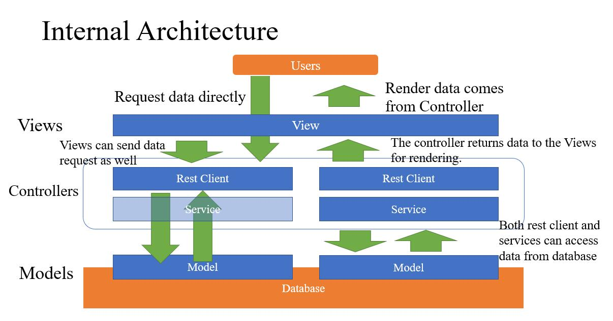
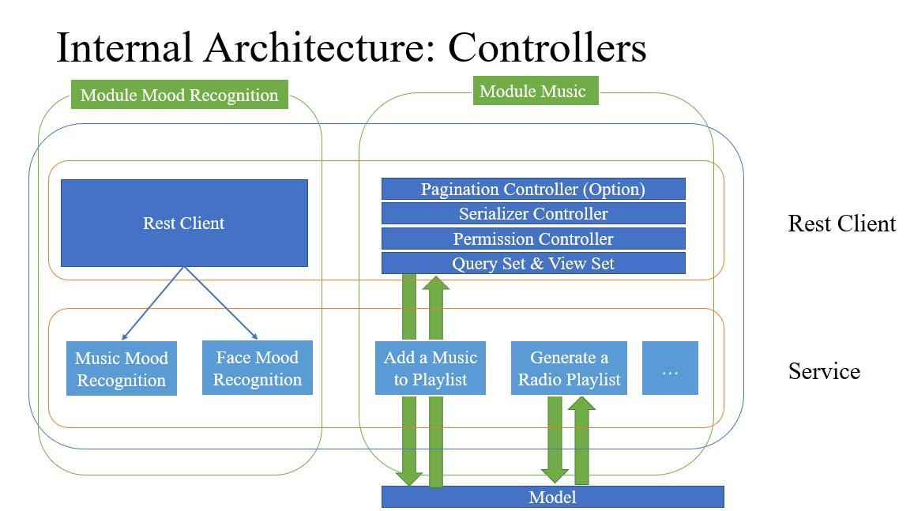
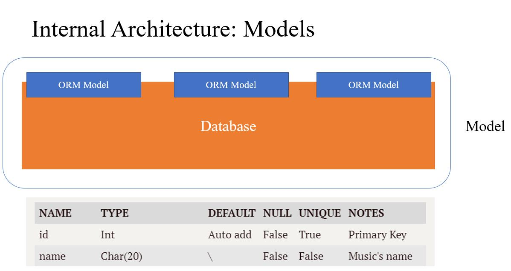
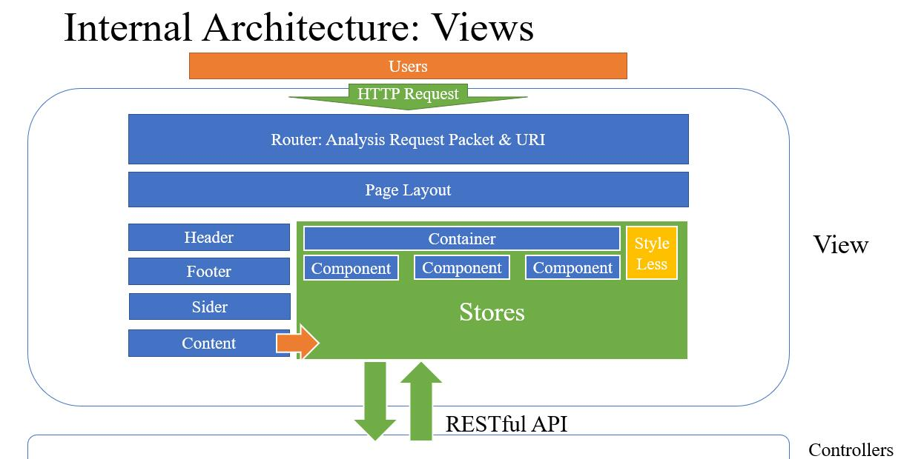
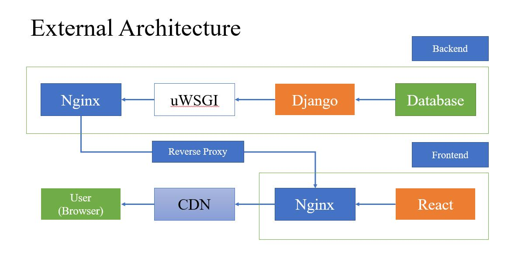

# Software Design Document

__Project Moosic__

Author: Touko, JeremyCJM, Colorofnight, Kyriezoe

__Version Control__

| Version | Date       | Participant | Description                             |
| ------- | ---------- | ----------- | --------------------------------------- |
| 0.1     | 2019-04-28 | Touko       | Initialize the Software Design Document |
| 0.2     | 2019-04-29 | JeremyCJM   | Updated the detailed design part        |
| 1       | 2019-05-03 | Touko       | Version Alpha                           |

__GitHub Repository__

<https://github.com/moosicse/>

# 1. Introduction

## 1.1 Purpose

This is a design document of the Project *Moosic*. This is a music player project that incorporates the ability to filter songs based on user mood. For information related to this project, please refer to the software requirements document. 

The intended readers of this manual are system designers, software developers, software testers, and project reviewers (QA Team).

## 1.2 Scope

This document defines the design portion of the software. The document includes software module design, internal interface design, data storage design, data flow design, external interface design, user interface design, algorithm and process logic, and so on, providing the basis for the normal development of software and system maintenance.

## 1.3 Definition and Acronyms 

### 1.3.1 HTTP Status Code

All HTTP response status codes are separated into five classes (or categories). The first digit of the status code defines the class of response. The last two digits do not have any class or categorization role. There are five values for the first digit.

- 1xx (Informational): The request was received, continuing process
- 2xx (Successful): The request was successfully received, understood, and accepted
- 3xx (Redirection): Further action needs to be taken in order to complete the request
- 4xx (Client Error): The request contains bad syntax or cannot be fulfilled
- 5xx (Server Error): The server failed to fulfill an apparently valid request

#### 200 OK

Standard response for successful HTTP requests. The actual response will depend on the request method used. In a GET request, the response will contain an entity corresponding to the requested resource. In a POST request, the response will contain an entity describing or containing the result of the action.

#### 301 Moved Permanently

This and all future requests should be directed to the given URI.

#### 303 See Other (since HTTP/1.1)

The response to the request can be found under another [URI](https://en.wikipedia.org/wiki/Uniform_Resource_Identifier) using the GET method. When received in response to a POST (or PUT/DELETE), the client should presume that the server has received the data and should issue a new GET request to the given URI.

#### 400 Bad Request

The server cannot or will not process the request due to an apparent client error (e.g., malformed request syntax, size too large, invalid request message framing, or deceptive request routing).

#### 401 Unauthorized ([RFC 7235](https://tools.ietf.org/html/rfc7235))

Similar to *403 Forbidden*, but specifically for use when authentication is required and has failed or has not yet been provided. The response must include a WWW-Authenticate header field containing a challenge applicable to the requested resource. 

Note: Some sites incorrectly issue HTTP 401 when an IP address is banned from the website (usually the website domain) and that specific address is refused permission to access a website.

#### 403 Forbidden

The request was valid, but the server is refusing action. The user might not have the necessary permissions for a resource, or may need an account of some sort.

#### 404 Not Found

The requested resource could not be found but may be available in the future. Subsequent requests by the client are permissible.

#### 405 Method Not Allowed

A request method is not supported for the requested resource; for example, a GET request on a form that requires data to be presented via [POST](https://en.wikipedia.org/wiki/POST_(HTTP)), or a PUT request on a read-only resource.

#### 406 Not Acceptable

The requested resource is capable of generating only content not acceptable according to the Accept headers sent in the request.

#### 408 Request Timeout

The server timed out waiting for the request. According to HTTP specifications: "The client did not produce a request within the time that the server was prepared to wait. The client MAY repeat the request without modifications at any later time."

#### 500 Internal Server Error

A generic error message, given when an unexpected condition was encountered and no more specific message is suitable.

#### 501 Not Implemented

The server either does not recognize the request method, or it lacks the ability to fulfil the request. Usually this implies future availability (e.g., a new feature of a web-service API).

#### 502 Bad Gateway

The server was acting as a gateway or proxy and received an invalid response from the upstream server.

#### 503 Service Unavailable

The server cannot handle the request (because it is overloaded or down for maintenance). Generally, this is a temporary state.

#### 504 Gateway Timeout

The server was acting as a gateway or proxy and did not receive a timely response from the upstream server.

### 1.3.2 Special Noun

- CURD

  In computer programming, create, read, update, and delete (CRUD) are the four basic functions of persistent storage. Alternate words are sometimes used when defining the four basic functions of CRUD, such as retrieve instead of read, modify instead of update, or destroy instead of delete. CRUD is also sometimes used to describe user interface conventions that facilitate viewing, searching, and changing information; often using computer-based forms and reports. 

- REST

  REST is acronym for REpresentational State Transfer. It is architectural style for distributed hypermedia systems and was first presented by Roy Fielding in 2000 in his famous dissertation.

# 2. References 

- Django - <https://docs.djangoproject.com/en/2.2/>
- Django Rest Framework - <https://www.django-rest-framework.org/>
- Representational State Transfer (REST) - <https://restfulapi.net/>
- React - <https://reactjs.org/>
- Mobx - <https://mobx.js.org/>
- Ant Design - <https://ant.design/>

# 3. Software Architecture

## 3.1 Internal Architecture

### 3.1.1 Brief Introduction

The Moosic project uses MVC's software architecture. It layers data, views, and controllers to ensure that the software is loosely coupled in the vertical direction. Part M (Model) is focused on data processing, Part V (View) is responsible for software interface rendering, user interface and user interaction, and Part C (Controller) is responsible for data processing and connecting parts M and V .

### 3.1.2 Design Concept

We believe that the loose coupling of software must be defined from the beginning of software design, so we have specified MVC as the internal architecture of our project. 

#### Model

As mentioned above, Part M is responsible for processing the data. Engineering data storage and invocation is solely the responsibility of Part M. Part M specifies the structure of the database, designing and storing engineering data in an object-oriented manner, and providing complete interface calls. The way the database is invoked is not called in the previous SQL Query mode, but in the way of ORM. This fits the code style of the object-oriented language we use (Python), and it also provides better maintenance complexity and lower coupling.

#### View

Part V is responsible for user interaction. It narrowly refers to the user interface in this project. The user interface is rendered by the browser, and logical operations are implemented through the API of the backend package, ultimately resulting in a complete user interaction process. The Part V performs only a few simple logical operations and does not perform more complicated logic processing. More difficult database operations or data filtering operations are handled by the backend. The main role of the Part V is to present the information sent from the backend to the user. The backend here is the Part C, which will be described below.

#### Controller

Part C is the part of this project. It reads and filters information from the M part (database), processes the data, and then sends the filtered data to the V part. It contains the following basic functions:

- Part C needs to pass the serialization module to strictly control the data to ensure that the least amount of data is returned.
- Part C needs to avoid unauthorized reading and writing of data.
- Part C is the last line of defense for incoming data to prevent malicious data injection from damaging the system.

So this is a module that needs the most careful consideration.
We first deprecated the way Django's own Template rendering methods and completely separating the project to frontend and backend architecture. They only correlating through data communication. This can make the program loose and easy to develop. At the same time reduce the pressure on the server, the page rendering is done by the user's browser. This may result in a bad experience for some users with lower configurations, but it can be ignored.
Second, in the MVC architecture, the Controller is the part we need most unit testing. We have defined the development plan for unit testing. Considering that the Part Model has a very low failure rate due to the commonly used framework, there is no need to write unit tests. Due to the particularity of the browser's work, the Part View must ensure that its code logic is reliable, and most of the problems that arise are Part Controller's problems, and there is no need for unit testing. Unit testing is very important in the controller that connects the above.
Therefore, we divide the Controller into two parts, one is the Views part of the Django framework, and the other is the Services section we specify. Views provides backend rendering in the original Django framework. But in this project, the Views section will focus on the packaging of the API. Thanks to the good interface and reliable packaging provided by Django-Rest-Framework, Views can be efficiently designed as CURD. But why do we have to be a separate service? Considering the coupling of the code and the possible reuse, it is a wise choice to separate some of the general logic or complex logic into Services. This design can provide a better Debug environment for subsequent development.

### 3.1.3 Diagram Explanation

#### Overall Design and Dataflow

You can see from the above figure [Internal Architecture] how the MVC architecture works in general and data flow. As mentioned above, View is responsible for rendering the interface. The View receives data from the Controller and renders it to the user. The Controller is responsible for data processing and can be subdivided into two parts: Rest Client and Service. In these two parts, the Rest Client part is closer to the View part, and the Service and Model parts are closer. View only interacts with the Rest Client, and the Rest Client and Service allow data interaction with the Model layer. The Model layer is the abstract expression and highly encapsulated database, and provides the object-oriented access interface of the database by means of ORM.

#### Controller Internal Design

The Controller layer is subdivided into two parts - the Rest Client and the Service layer. The Rest Client layer is close to the View, when the Service layer is close to the Model. The Rest Client layer, as its name implies, mainly performs tasks that encapsulate the API that conforms to the Rest standards, and handles some simple CURD operations, as well as permission control. The Service layer is a collection of frequently used, highly encapsulated APIs. Some algorithms with large computational complexity and complex logic are also encapsulated at this layer.

The figure [Internal Architecture: Controllers] is an abstract architecture diagram of the Controller, where the vertical is divided into Module and the horizontal is divided into software architecture layers. Different Service will be divided according to different Modules, and the location where the Service code is placed is the location of the Model that is mainly responsible for it. Different Clients will also be divided according to the Module. The Service layer and the Rest Client layer in each Module form the Controller layer of the Module.
The main function of the Rest Client layer is to encapsulate the CURD interface, aggregate the Service function, and encapsulate the API that conforms to the Rest standard to the front end. Unlike the traditional MVC architecture, users do not have direct access to the input interfaces of the Rest Client package. Requests made by users to these interfaces will be proxy accessed by the front end. For questions related to the Rest standard, please refer to [2.References].
The functions provided by the Rest layer from top to bottom are paging module (optional), serialization module, user permission control module, Query Set and View Set encapsulation module. In the program, there will be a separately designed Permission Control module to judge the user rights. The serialization module and the paging module will also be designed independently to meet the low coupling degree of the software.

The Service layer encapsulates code blocks that satisfy the following conditions: reusable, or logically complex, or some of the most widely used database operations. For example, in our Mood Recognition module, song sentiment analysis can be packaged as a stand-alone Service, while face emotion analysis can also be used as a separate service package. When Rest Client is working, it can selectively call different services according to their own functions and combine their functions.

#### Models Internal Design

We use a relational database as the database used by the data storage module. The database and ORM encapsulation layer are broadly defined as the Model layer. In the diagram above [Internal Architecture: Models], we can see how the database and the ORM package module work. In actual programming, we only need to consider how the content in the database is stored. Referring to the data sheet located below the figure, the parts we need to consider are

- name - the name of the query's column
- type - the type of the query's column
- default - the default value of the query's column
- null - whether the column allow null
- unique - whether the column requires unique
- notes - other precautions

#### Views Internal Design

In fact, the View layer and the other two layers use different code repositories that run in different environments. The View layer and the Controller layer communicate using an API that conforms to the Rest standard. Referring to the figure above [Internal Architecture: Views], when the user accesses the page, the HTTP packet is first received by the page Router and analyzes the URI condition, and different pages are rendered according to different URIs. The page is first divided into Layout design, which includes Header, Footer, Nav Sider and the main Content section. The Content part is the entry of the Container, and each Container consists of several Components. The data interaction is all done by the Store, and the Less is used as the front-end style rendering module.

## 3.2 External Architecture

### 3.1.1 Brief Introduction

As mentioned above, we will use a separate architecture at the frontend and backend, with the connection of database located at the side of backend. A more detailed description of the external architecture of this program is provided below.

### 3.1.2 Design Concept

The program will be divided into frontend and backend for development. The frontend and backend are each placed in different code repositories, using different languages but sharing the same set of APIs and data structures. 

#### External Architecture (Frontend)

When the user opens the browser and accesses our web page, the browser's URL will be forwarded to index.html. This logic is implemented by Nginx. The first thing that is presented to the user is the layout of the frontend. Layout includes Header, Footer, Navigator (Menu) and Content. The Content section will be routed by the URL to distribute the user to different pages.
The frontend will be divided into modules. There is a route inside each module to control the routing of pages within the module. Software frontend routing will be structured as follows. The global route first directs the user to a different module based on the URL matching result. The intra-module routes are then matched to provide user interaction and other related services.

To get a compact and scalable structure, we use Nginx as the web server program. It provides two basic function: Web Server and Reverse Proxy Server. Nginx will open a web access port to the frontend page after the compilation and build, and provide access to the user's frontend web page. At the same time, the backend Django will be reverse proxyed. The purpose of this is to prevent browsers from cross origin errors and providing users with secure web access. 

#### External Architecture (Backend)

The backend provides API services to frontend web pages through Nginx's reverse proxy. The backend is also divided into modules. The module takes Model as the core and provides API through Views and Services in the Controller layer. At the same time, parts such as event triggers, global constants, and timing parallel tasks may exist in the module at the same time. The module was previously associated with the global settings file, using Django's own routing for access control between different APIs.

The backend currently uses the SQLite3 database. As a start-up project, the database pressure is not heavy, so there is no need to use a commercial high-concurrency high-stress database. The program's music files are allowed to be stored in multiple sources. The current server, third-party storage repository or CDN can be used as the storage location for static music files. The cache uses the native memory cache. It is expected that the larger cache will not be used at present, and there is no need to worry about cache hot swap.

# 4. Decomposition Description 

## 4.1 Module Decomposition 

### 4.1.1 Module Music 

#### Overview

Module Music is the most important module of this project. It provides a fully controller of music in one website. Music's information is stored here, working together with the music's service and views to provide the operation for both user and staff.

#### Scope

Module Music mainly stores music-related data in a narrow range, such as the song's name, song files, foreign keys of a singer and so forth. The music module does not process other related information, such as albums, singers, this part of the information is stored by the extra module, and only the foreign keys are processed in the music module. 

Module Music contains one of the most significant service of this project - mood recognition service. Although the mood recognition module is not a separate module, it needs to be a separate service and belongs to the Module Music. To get a brief description and detailed design information, please refer to the [7.3 Service Detailed Design](#7.3 Service Detailed Design).    

### 4.1.2 Module User

#### Overview

The Module User is used to store all user-related information, including user attributes, permissions, and so on. The Module User has a one-to-one correspondence with the users provided by Django's own Authentication module, which facilitates user login and session permission control.

#### Scope

The Module User stores user-related information. Whether the user is a Staff or Super Administrator is set and executed by the Django Authentication module. Some songs require permission control, and the Module User can set a permission group Model separately. When the song needs permission control, the user is added to the permission group, and the song is set to the permission, so that the authority can control the song. Doing so allows users to privately upload songs or share songs in small circles.

User preferences and recent mood information will also be stored in the Module User. This allows the program to better push songs or filter songs for the user, allowing the program to do smarter things.

## 4.2 Business Process Decomposition

Here are a decomposition of several business processes that will be widely used. 

### 4.2.1 Business Play Music

#### Entry

The most important function of the music player is to play music, so the music playing business will be the most frequent and most reliable business. The user may play music at any time, such as searching for a song and clicking on the search result, clicking on the song in the album, clicking on the song on the artist page, playing a song on the radio or song list, triggers the music playing music.

#### Process

When the user initiates a song request, the program passes a music id. The program will find the corresponding song based on this id and return music information and binary streaming media files. After the browser receives the relevant information, it provides the user with browser-level music playback. 

As mentioned above, the storage location of the music streaming media file can be arbitrary. In the case of initial service operations, music files can be placed in a public folder and stored in a database. Provide the interface to the user when the user needs it. If it is stored in the CDN, when the music is uploaded, the music file is directly transmitted to the CDN, and the resource address corresponding to the CDN is recorded. In this case, when the user acquires music, the program first confirms the user's authority on the music file. If the user is allowed to access the music file, the system will provide a temporary token to the user, allowing the user to obtain the streaming file directly from the CDN.

### 4.2.2 Business Next Song With Mood Recognition

#### Entry

One of the biggest differences between our project and the traditional music player is that it will randomly play and filter the music according to the user's mood. This service will be activated when the user turns on the song according to the mood and performs music switching.

#### Process

In order to complete this set of services, we must first model the mood based on each song. We use the pre-trained neural network to judge the mood of the song according to the tune, rhythm, lyrics and other information of the song, and score the song in several mood dimensions and store it in the song information. The use of pre-trained neural networks is due to the problem of server performance. It is not possible to run a stressful model on the server. It is necessary to use additional computational power for model training.

After the modeling is completed and the music mood score is given, we need to establish a mood transition state map of human maximum probability based on the existing research to provide services for the subsequent operations. The purpose of this is to recommend the most suitable music by the user's current mood, the ultimate goal is to keep the user in a better mood state. We consider a variety of ways to get user mood, such as face recognition, arm swing frequency, heart rate and so on. Considering the limitation of system calls, we currently only consider the way of face recognition to get the user's mood. Here again a new neural network is needed.

The neural network is based on existing facial recognition methods and provides a multi-dimensional user facial expression scoring, such as happiness, sadness, anger, and the like. The model needs to be as lean as possible and able to judge the user's mood faster. In the business process, we first ask the user to agree to take the user's face image, then judge the user's mood, and finally recommend the song according to the recommendation method described above.

# 5 Dependency Description

Only important program dependencies will be introduced here.

## 5.1 Backend Dependency

### 5.1.1 Python

#### Website

<https://www.python.org/>

#### License

<https://docs.python.org/3/license.html>

### 5.1.2 Django

#### Website

<https://www.djangoproject.com/>

#### Overview

Django is a high-level Python Web framework that encourages rapid development and clean, pragmatic design. Built by experienced developers, it takes care of much of the hassle of Web development, so you can focus on writing your app without needing to reinvent the wheel. It’s free and open source.

#### License

<https://github.com/django/django/blob/master/LICENSE>

### 5.1.3 Django Rest Framework

#### Website

<https://www.django-rest-framework.org/>

#### Overview

Django REST framework is a powerful and flexible toolkit for building Web APIs.

#### License

<https://www.django-rest-framework.org/#license>

## 5.2 Frontend Dependency

### 5.2.1 JavaScript

#### Website

<https://www.javascript.com/>

### 5.2.2 React

#### Website

<https://reactjs.org/>

#### Overview

A JavaScript library for building user interfaces.

#### License

MIT License

<https://github.com/facebook/react/blob/master/LICENSE>

### 5.2.3 MobX

#### Website

<https://mobx.js.org/>

#### Overview

MobX is a battle tested library that makes state management simple and scalable by transparently applying functional reactive programming (TFRP).

#### License

MIT License

<https://github.com/mobxjs/mobx/blob/master/LICENSE>

### 5.2.4 Ant Design

#### Website

<https://ant.design/>

#### Overview

A design system with values of Nature and Determinacy for better user experience of enterprise applications.

#### License

MIT License

<https://github.com/ant-design/ant-design/blob/master/LICENSE>

## 5.3 Database Dependency

### 5.3.1 SQLite3

#### Website

<https://www.sqlite.org/index.html>

#### Overview

SQLite is a C-language library that implements a [small](https://www.sqlite.org/footprint.html), [fast](https://www.sqlite.org/fasterthanfs.html), [self-contained](https://www.sqlite.org/selfcontained.html), [high-reliability](https://www.sqlite.org/hirely.html), [full-featured](https://www.sqlite.org/fullsql.html), SQL database engine. SQLite is the [most used](https://www.sqlite.org/mostdeployed.html) database engine in the world. SQLite is built into all mobile phones and most computers and comes bundled inside countless other applications that people use every day.

#### License

<https://www.sqlite.org/copyright.html>

## 5.4 Automatic Build Dependency

### 5.4.1 Ansible

#### Website

<https://www.ansible.com/>

#### Overview

Ansible is a radically simple IT automation platform that makes your applications and systems easier to deploy. Avoid writing scripts or custom code to deploy and update your applications — automate in a language that approaches plain English, using SSH, with no agents to install on remote systems.

#### License

GNU General Public License v3.0

<https://github.com/ansible/ansible/blob/devel/COPYING>

# 6 Interface and Service Description

## 6.1 User Interface Description

The program is mainly composed of three interfaces: music player interface, user personal information interface and song management interface. Among them, the staff or users who upload songs themselves can access the song management interface, and most ordinary users only provide the rights of the music playing interface and the personal information interface.

The User Interface of the program is as close as possible to the SPA (Single-page application). This provides a complete immersive music playback experience and is in line with our original intention to design this app – providing a lightweight music player for music lovers.

As for the functions of music search, song information viewing, album viewing, etc, it will be designed in the form of a pop-up window. The main body of the music player is a play console. When the user needs to call up the album interface, the interface will pop up from the edge.

## 6.2 Service Description

The most important services of the program are mood recognition services and song emotional judgment recommendation services.

Mood recognition services are built on computer vision technics which take as input users' uploaded photos. The deep neural networks (DNN) are used to extract features and output users' current mood.

Song emotions are basically judged from waveforms of music. While calm music usually presents a smooth waveform, angry music exhibit more peals and fluctuations. Again, deep learning is utilized.

We may implement the algorithms ourselves, or using APIs directly.

# 7 Module Detailed Design

**Note**: Since the Rest Framework already encapsulates a complete set of CURD data interfaces, we don't have to code for simple data reads and writes. For example, we can get song information directly under the conditions allowed by the Permission Control module.

**Only some examples of interfaces are listed here. Other interfaces will be designed according to business processes. The template are the same as the examples here.**

## 7.1 Module Music

The model that should be included in the Module music has songs, albums, singers, and genres. The main body is songs, albums, singers and genres are connected by foreign keys and songs. The information contained in the song mainly includes song name, song file name, genre, mood information, and the like. The album mainly includes album names, participating singers, album profiles and other information. The singer mainly includes information such as the name of the singer The genre simply includes genre name information.

Permission Control:

The music module is read-only for ordinary users with permissions and readable and writable for staff and administrators. An anonymous user who is not logged in also belongs to a class of users who have ordinary user rights, and the corresponding rights are specified by the user group.

### 7.1.1 Model

All music related models will be specified here.

#### Song

| Name        | Type                | Default  | Null  | Unique | Notes                         |
| ----------- | ------------------- | -------- | ----- | ------ | ----------------------------- |
| id          | Int                 | Auto add | False | True   | Primary Key                   |
| name        | Char(20)            | \        | False | False  | Music's name                  |
| singer      | Foreign(Singer)     | \        | True  | False  |                               |
| album       | Foreign(Album)      | \        | True  | False  |                               |
| genres      | Foreigns(Genre)     | \        | True  | False  |                               |
| mood        | Dict                | \        | True  | False  |                               |
| user_group  | Foreigns(UserGroup) | \        | True  | False  | Users who can access          |
| location    | Char(255)           | \        | False | True   | File path of the song's file. |
| description | TextField           | \        | True  | False  |                               |

#### Singer

| Name        | Type      | Default  | Null  | Unique | Notes       |
| ----------- | --------- | -------- | ----- | ------ | ----------- |
| id          | Int       | Auto add | False | True   | Primary Key |
| name        | Char(20)  | \        | False | False  |             |
| gender      | Int       | \        | True  | False  |             |
| birthday    | DateField | \        | True  | False  |             |
| country     | Char(20)  | \        | True  | False  |             |
| description | TextField | \        | True  | False  |             |

#### Album

| Name           | Type             | Default  | Null  | Unique | Notes       |
| -------------- | ---------------- | -------- | ----- | ------ | ----------- |
| id             | Int              | Auto add | False | True   | Primary Key |
| name           | Char(20)         | \        | False | False  |             |
| singer         | Foreigns(Singer) | \        | True  | False  |             |
| published_date | DateField        | \        | True  | False  |             |
| description    | TextField        | \        | True  | False  |             |

#### Genre

| Name | Type     | Default  | Null  | Unique | Notes       |
| ---- | -------- | -------- | ----- | ------ | ----------- |
| id   | Int      | Auto add | False | True   | Primary Key |
| name | Char(20) | \        | False | True   |             |

#### Playlist

| Name  | Type           | Default  | Null  | Unique | Notes       |
| ----- | -------------- | -------- | ----- | ------ | ----------- |
| id    | Int            | Auto add | False | True   | Primary Key |
| songs | Foreigns(Song) | \        | True  | False  |             |

### 7.1.2 Rest Client

#### Upload song

**URL** 

/api/song/upload/

**Method** 

POST

**Interface**

| IO     | name      | type        | Notes  |
| ------ | --------- | ----------- | ------ |
| Input  | song_id   | Int         |        |
| Input  | song file | Byte stream |        |
| Input  | singer_id | Int         | Option |
| Input  | album_id  | Int         | Option |
| Output | \         | \           |        |

**Algorithm**

Add a song to the cloud storage. If upload succeed, return status code 200, else status code 403.

### 7.1.3 Services

#### Upload song

**Interface**

| IO     | name      | type        | Notes         |
| ------ | --------- | ----------- | ------------- |
| Input  | song_id   | Int         |               |
| Input  | song file | Byte stream |               |
| Input  | singer_id | Int         | Option        |
| Input  | album_id  | Int         | Option        |
| Output | \         | Bool        | Upload result |

**Algorithm**

Firstly, create a song object based on the information provided above. Then de-serialize the song file's byte stream and store it at proper location.

#### Add a song to playlist

**Interface**

| IO     | name        | type | Notes      |
| ------ | ----------- | ---- | ---------- |
| Input  | song_id     | Int  |            |
| Input  | playlist_id | Int  |            |
| Output | \           | Bool | Add result |

**Algorithm**

Find the playlist by playlist_id, then add the song to the playlist.

#### Remove a song from playlist

Same as Add a song to playlist, no details.

## 7.2 Module User

The Module User mainly contains two models of user and user group. The user model mainly stores user-related information, and the user group is used to group users and classify user permissions.

For example, if the song M is a song that requires permission to access, and only the user of the user group G is allowed to access. As an administrator, first add the user to the user group, then set the user group's access to the song, and set the song to require access. Thus, when an unprivileged user accesses the song, the access action is restricted. When a user in the G user group accesses the song M, the user can access the song M due to permission.

Music information is available to all users, while moods are users' privacy and are visible only to the system. 

### 7.2.1 Model

#### User Profile

| Name         | Type            | Default  | Null  | Unique | Notes               |
| ------------ | --------------- | -------- | ----- | ------ | ------------------- |
| id           | int             | Auto add | False | True   | Primary Key         |
| user         | Foreign(User)   | \        | False | True   | Django provide user |
| name         | Char(20)        | \        | Fasle | True   |                     |
| motto        | TextField       | \        | True  | False  |                     |
| prefer_genre | Foreigns(Genre) | \        | True  | False  |                     |

#### User Group

| Name | Type                  | Default  | Null  | Unique | Notes       |
| ---- | --------------------- | -------- | ----- | ------ | ----------- |
| id   | Int                   | Auto add | False | True   | Primary Key |
| name | Char(20)              | \        | False | True   |             |
| user | Foreigns(UserProfile) | \        | True  | False  |             |

### 7.2.2 Rest Client

#### User Register

**URL** 

/api/register

**Method** 

POST

**Interface**

| IO     | name     | type     | Notes            |
| ------ | -------- | -------- | ---------------- |
| Input  | username | Char(20) |                  |
| Input  | E-mail   | Email    |                  |
| Input  | password | Char(20) |                  |
| Output | \        | JSON     | User information |

**Algorithm**

Create a Django user and bind the User Profile.

#### User Login

**URL** 

/api/login

**Method** 

POST

**Interface**

| IO     | name     | type     | Notes                            |
| ------ | -------- | -------- | -------------------------------- |
| Input  | username | Char(20) |                                  |
| Input  | password | Char(20) |                                  |
| Output | \        | JSON     | User information and user login. |

**Algorithm**

Check user info by django's built-in function and login or return status=403 when the username and password not match.

#### User Logout

**URL** 

/api/logout

**Method** 

POST, GET

**Interface**

No I/O.

**Algorithm**

Logout user.

### 7.2.3 Services

#### User have access to the song

**Interface**

| IO     | name | type        | Notes |
| ------ | ---- | ----------- | ----- |
| Input  | song | Song        |       |
| Input  | user | UserProfile |       |
| Output | \    | Bool        |       |

**Algorithm**

The program will check if the song has user group field and check that if the user is in the specific user group. If in, return True, otherwise False. If the song has no user group, default that it is public.

## 7.3 Mood Recognition Module

### 7.3.1 Model

This module use music and face image as input, in which muisc is already stored in the module music. The face image is directly shoot by camera, so there is **no** need to set up a database for this module.

###7.3.2 Rest Client

####7.3.2.1 Add the emotion label using service music emotion recognition

When a music is added into the database, we will use the facial recognition service to automatically add a emotion label to the music.

####7.3.2.2 Generate a playlist with specific emotion according to the user's mood using the facial mood recognition service and recommendation service

When the uer click on a specific button named "Emotion Player Button", the camera firstly capture a facial image of the user and then use the facial empotion recognition service to get the user's emotion, and then use the recommendation service to recommend music with specific mood to the user with cprresponding facial emotion.

### 7.3.3 Service

####7.3.3.1 Facial Mood Recognition

- I/O Form

| Name         | I/O    | Data Type | Range           |
| ------------ | ------ | --------- | --------------- |
| Facial Image | Input  | Binary    | 0~20 MB         |
| Face Emotion | Output | String    | 0~10 characters |

- Internal Logic

This service takes user's facial photo as input and output user's mood. Emotive analytics is an interesting blend of psychology and technology. Though arguably reductive, many facial expression detection tools lump human emotion into 7 main categories: Joy, Sadness, Anger, Fear, Surprise, Contempt, and Disgust. With facial emotion detection, algorithms detect faces within a photo, and sense micro expressions by analyzing the relationship between points on the face, based on curated databases compiled in academic environments. The most popular and precise models are neural networks. We might choose one of the facial mood recognition API mentioned here (https://nordicapis.com/20-emotion-recognition-apis-that-will-leave-you-impressed-and-concerned/) as our facial mood recognition service.

#### 7.3.3.2 Music Emotion Recognition

- I/O Form

| Name    | I/O    | Data Type     | Range            |
| ------- | ------ | ------------- | ---------------- |
| Lyric   | Input  | String        | 0~1000 character |
| Audio   | Input  | Binary Stream | 0~20MB           |
| Emotion | Output | String        | 0~10 character   |

- Internal Logic

This service takes music (including audio and lyrics) as input, and output the emotion of the music. The recognition of musical mood is not as mature as that of facial mood. There is a state-of-the-art research combining lyrics (sentiment analysis in NLP) with audio (CNN) to get a bimodal neural network to classify the emotion of music (https://arxiv.org/abs/1809.07276). For pure music without lyrics, we only use audio neural network to do the classification. We will try to implement this neural network from scratch to fulfill the requirement of this service. We will also consider using this repo on github (https://github.com/danz1ka19/Music-Emotion-Recognition) as reference.

The architechture of the deep neural network for music emotion recognition is like the following,

####7.3.3.3 Recommendation

The mapping from the facial mood to musical emotion is as following:

| facial mood | musical emotion |
| :---------: | :-------------: |
|     Joy     | Happy, Excited  |
|   Sadness   |    Sad, Calm    |
|    Anger    |      Calm       |
|  Surprise   |     Excited     |

Using this mapping form, we recommend music with specific mood to the user with cprresponding facial emotion.

