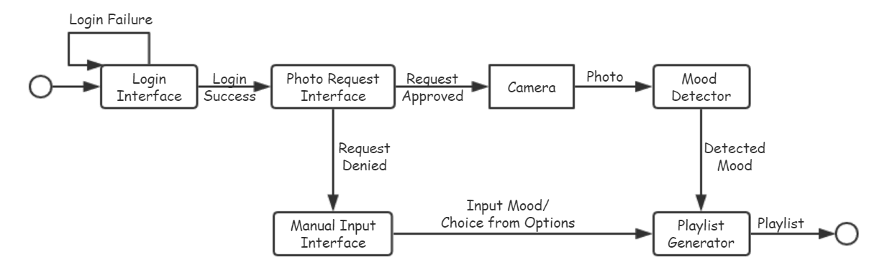
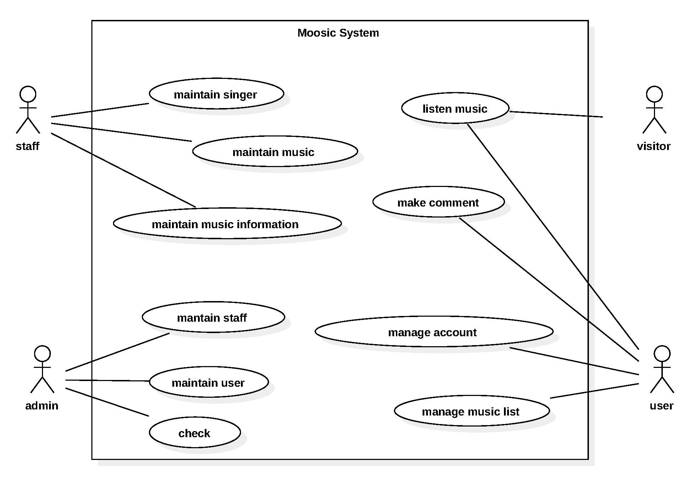
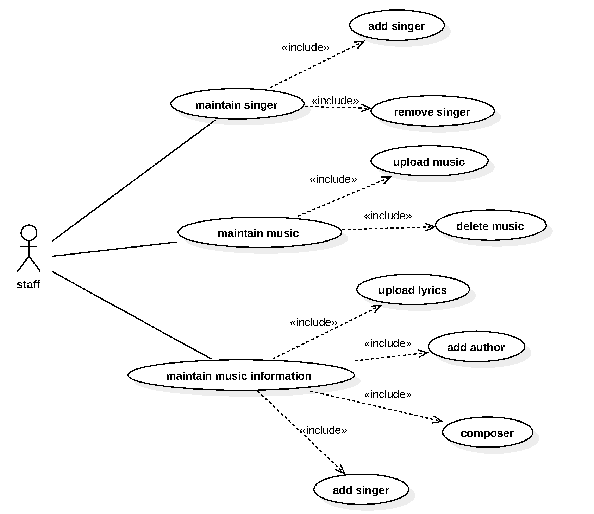
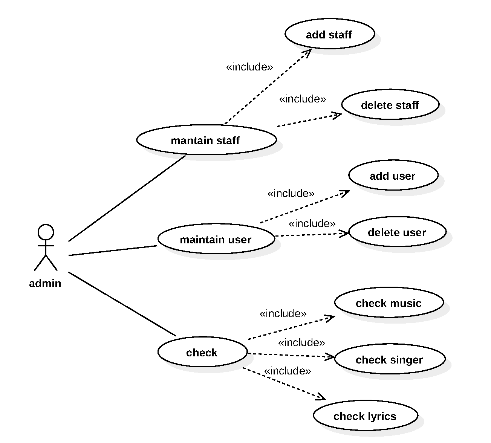
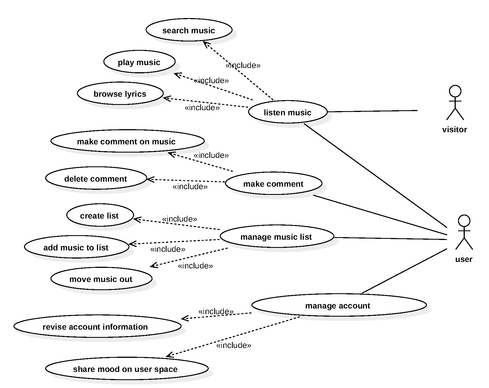
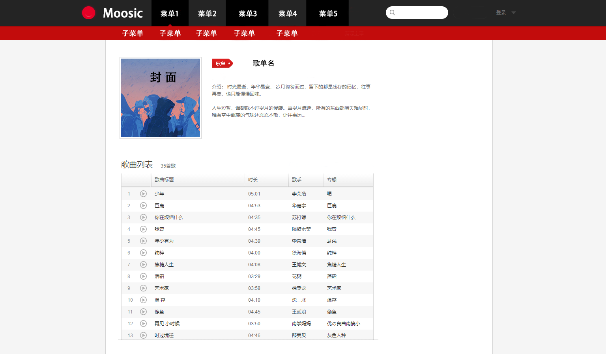

# Software Requirement Specification

__Project Moosic__

Author: Colorofnight

__Version Control__

| Version | Date       | Participant  | Description                                       |
| ------- | ---------- | ------------ | ------------------------------------------------- |
| 0.1     | 2019-04-20 | Colorofnight | Initialize the Software Requirement Specification |
| 0.2     | 2019-05-04 | JeremyCJM    | Updated the Software Requirement Specification    |
| 1.0     | 2019-05-05 | Colorofnight | Version Alpha                                     |

# 1. Introduction

## 1.1 Purpose of this document

The purpose of this document is to provide a reference and overview of the requirements for a website and social presence for the Mood-based Music storing and sharing platform.

## 1.2 Scope of this document

The requirement elicitation consisted of Touko, JeremyCJM, Colorofnight and Kyrie. These members were responsible for obtaining and presenting the requirement information that exists in this document.

## 1.3 Overview

Upon completion of the project, a mood-based music storing platform will be presented in the form of a website. It’s able to support recommendation considering users’ emotions.

## 1.4 Business Context

Nowadays everyone enjoys listening to music and music apps have become part of people’s life. Particularly, the music recommendation system is more and more significant in the users’ experience, and it also plays an important role in gaining the loyalty of users.

# 2. General Description

## 2.1 Product Functions

Music recommendation based on users’ mood, basic functions of a music player and a storing platform.

## 2.2 Similar System Information

The final product will be similar but superior to most existing commercial/business websites like Netease cloud music. The two main goals of the final product are to practice SE skills, and to provide a brand new musical experience.

## 2.3 User Characteristics

The users of the platform will mainly be music lovers, who have a high demand for music experience.

## 2.4 User Problem Statement

Most music platforms are lacking mood-based recommendation functions.

## 2.5 User Objectives

The user objective is to recommend music to users based on their moods when using the platform. We need to judge users’ emotion based on their facial expression when logging in and match their moods with the music of different styles. *We do not have to implement the facial mood recognition neural network from scratch, because there are already many mature API and code on Internet.*

## 2.6 General Constraints

The largest constraints placed on this project is time and format. Our developers are given nearly three months to complete this project in its entirety. Because of this constraint, we opted to implement very basic functions and UI on website and the transplantation to android is optional.
 
# 3. Functional Requirements  

The simplified state diagram of the system is shown in Figure 3.1 below. Privacy protection is required at Login Interface and after Login. After calling the camera, Mood recognition is required at the state Mood Detector. At state Playlist Generator, generating playlist according to mood requires Music classification.
__Figure 3.1 Simplified State Diagram__

## 3.1 Privacy Protection

The website shall prevent any people other than the user from accessing his/her music list through password protection.

1. Description  

  Before being allowed access into her music warehouse, the user must first provide a valid username and password.

2. Technical issues  

  The login accounts are created in a SQL database that must be created separately. Input: username and password.

3. Risks  

  User accounts can be compromised by lost or misplaced passwords that could inherently lead to misinformation. Accounts can be given a new password or deactivated through the SQL administration.

## 3.2 Mood Recognition

The platform should be able to judge users’ moods by photos taken when user enter into the song recommendation page.

1. Description  

  Before music recommendation, the system calls the camera to acquire the facial expression of the user, and then calls the mood recognition API according to the facial expression to determine the current mood of the user.

2. Technical issues  

  The function is achieved with computer vision techniques.

3. Risks  

  Inaccurate judgement can affect user experience.

## 3.3 Music Emotion Recognition

The system should be able to recognize the emotion of music.

1. Description  

  Taking the music and its lyrics (if exists) as input, the music emotion recognition system should output the emotion of this music.

2. Technical issues  

  Utlize sentiment analysis techniques in NLP to get the emotion of lyrics.  Using deep learning to recognize the emotion from audio wave graph.

3. Risks  

  The recognition of music emotion is not mature. We might not able to realize the function on time.

4. **Alternative Requirement**

  If the music emotion recognition function can not be realized on time, we will use this alternative requirement: 
Give each music in our database a emotional label by hand.
  We could also use spider program to get the playlists that have emotional words in its title (e.g. *Songs to listen when sad*) on Netease Music, then label the music in this playlists corresponding emotion.
  

## 3.4 Music Player

The basic functions that the music player needs, which include play, pause, resume, play next, random play, volume adjust, etc.

## 3.5 Music Recommendation

According to the mood of the user obtained by the mood recognition, combined with the music classification, recommend the music suitable for the user to listen to at this time.

## 3.6 Music Management

Users can manage their own music, including uploading, downloading and deleting, and can set the music as a favorite, create a song list and add songs to the song list.

## 3.7 Music Community

Users can post their own comments under each song and share song links to their like-minded friends.
 
## 3.8 Use Case Model

The top use case is shown in Figure 3.2, and the sub use cases for admin, staff and user & visitor is shown respectively in Figure 3.3, Figure 3.4 and Figure 3.5
__Figure 3.2 Top Use Case__

__Figure 3.3 Staff Use Case__

__Figure 3.4 Admin Use Case__

__Figure 3.5 User & Visitor Use Case__

# 4. Interface Requirements

## 4.1 User Interfaces

User interaction is largely graphical based using principles from perceptual human and computer interaction.

### 4.1.1 GUI

The GUI is based on a website,and the design is made a reference to the Netease Cloud Music[1] and QQ music[2] on website.
The preliminary design style of the user interface is shown in the Figure 4.1 below.

__Figure 4.1 Preliminary Interface Design__

### 4.1.2 API

- Camera
- Emotion detection and recognition
- Music emotion recognition(optional)

## 4.2 Hardware Interfaces

This project is completely software based, so there is no direct hardware interface, and all mouse and keyboard input can use the interface provided by the operating system.

## 4.3 Software Interfaces

This system can be used directly by accessing a given ip with a web browser.

## 4.4 Communications Interfaces

A basic internet connection is required to view the website, which uses TCP/IP network protocol.

## 4.5 development tools

The IDA website utilizes the following web components:
- Django
- Django Rest Framework
- React
- Mobx
Database support:
- SQLite3

# 5. Performance Requirements

## 5.1 Software requirement

The Moosic website will require a computer with an active internet connection to be able to view the website and its camera to capture images. The computer's web browser must be Internet Explorer 6 or above, Firefox, Chrome, or any current browser able to view a website with W3C certification.

## 5.2 Hardware requirement

The system will handle malicious interface calls or sporadic errors, such as returning a 403 HTTP status code.
The server should run at 1GHz CPU speed and 1G memory under the Linux operating system. In addition to static files of songs, at least 100M space should be reserved.
The API server must have at least 1 Mbps of bandwidth, and the music storage server should have at least 10 Mbps of bandwidth.

## 5.3 Network requirement

For the user, a network with 10M bandwidth is required, while for API server, only 1M bandwidth is enough.

## 5.4 System performance requirment

The system should be able to meet the concurrency of about 10 people.Guarantee that 99% of the API can be made within 1000ms. The remaining APIs that may not be completed within the specified time should be accelerated to 5000ms using methods such as caching. 

# 6. Other non-functional attributes

## 6.1 Security

The username and password shall be unique to each authorized user. The authorized user should forget their login information, a link to have it emailed shall be provided.

## 6.2 Binary Compatibility

The website will be operational with any operating system that can use modern browsers that support HTML 4.01 and partial support of CSS2.

## 6.3 Reliability

The main website should remain online as long as the hosting servers are functional.

## 6.4 Portability

The web presence should be viewed on all computers with an internet connection provided they have a compatible web browser.

## 6.5 Reusability

The home page shall provide an efficient, aesthetically pleasing layout that can be used as a foundation for any upcoming sub pages or a future overhaul of the website.

## 6.6 Application Affinity/Compatibility

The web presence shall be compatible with all modern web browsers (IE 6+, Chrome, Firefox, Safari, etc.).

## 6.7 Serviceability

The platform will provide the users an easy-to-use interface with capabilities to manage their music warehouse.
  
# 7. Appendices

## 7.1 Definitions, Acronyms, Abbreviations

- HTML: Hyper-Text Markup Language
- IDA: Intellectual Disabilities Agency
- IDANRV: Intellectual Disabilities Agency of the New River Valley
- PS: Photoshop
- W3C: World Wide Web Consortium
- SQL: Structured Query Language
- CSS: Cascading Style Sheets
- API: Application Programming Interface

## 7.2 References

Provides complete citations to all documents and meetings referenced or used in the preparation of this document.

GUI design references
1. [Netease Cloud Music](https://music.163.com)
2. [QQ Music](https://y.qq.com)

API references
1. https://nordicapis.com/20-emotion-recognition-apis-that-will-leave-you-impressed-and-concerned/
2. https://www.microsoft.com/developerblog/2015/11/29/emotion-detection-and-recognition-from-text-using-deep-learning/
3. https://github.com/tlkh/text-emotion-classification
4. https://github.com/sterling239/audio-emotion-recognition
5. https://github.com/MikeMpapa/CNNs-Audio-Emotion-Recognition
6. https://ieeexplore.ieee.org/document/7860930
7. http://mac.citi.sinica.edu.tw/~yang/pub/yang12tist.pdf

