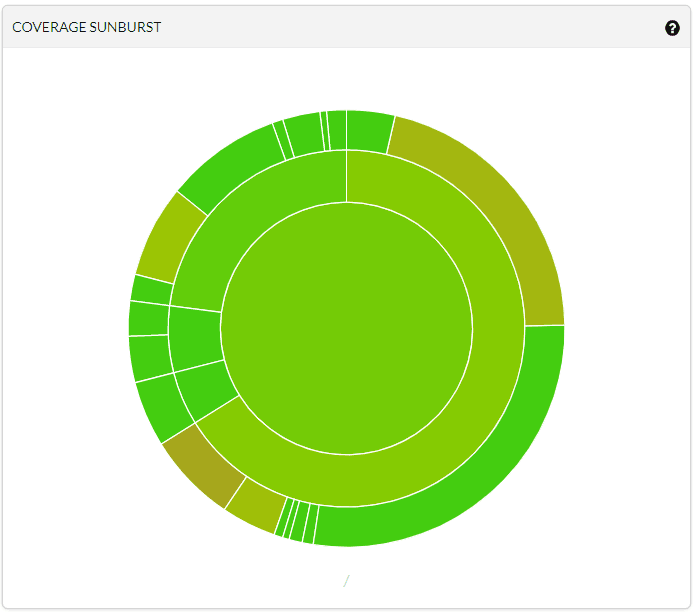

# Software Test Document

__Project Moosic__

Author: Colorofnight, Touko

__Version Control__

| Version | Date       | Participant  | Description                                  |
| ------- | ---------- | ------------ | -------------------------------------------- |
| 0.1     | 2019-05-11 | Colorofnight | Initialize the Software Test Documentation   |
| 0.2     | 2019-05-13 | Colorofnight | Translate the contents of table into English |
| 0.3     | 2019-05-14 | Touko        | Markdown                                     |
| 1.0     | 2019-05-19 | Colorofnight | Add Test Cases                               |
| 1.1     | 2019-06-12 | Colorofnight | Update Unit/Integration Testing              |
| 1.2     | 2019-06-13 | Colorofnight | Revise                                       |

__GitHub Repository__

<https://github.com/moosicse/>

# 1. Overview

## 1.1 Purpose

This document is a test document for the Project *Moosic*. The purpose is to design the test plan and test cases for the software so that the tester can accept the project based on this document.

The intended readers of this manual are software developers, software testers, and project reviewers (QA Team).

## 1.2 Scope

This document defines the test portion of the software. The document includes test schedule, test design for acceptance testing, system testing, integration testing and unit testing, and test cases for the four testing mentioned before.

## 1.3 Test Objectives

Test documentation is designed according to the following documents.

| **Documents**                    | **Version** | **Date**   |
| -------------------------------- | ----------- | ---------- |
| *Software Requirement Document*  | 1.1         | 2019-06-12 |
| *Software Design Document*       | 1.1         | 2019-05-05 |

The test object is the functional modules in the requirements document and the system architecture in the brief design document.

## 1.4 Audience

- Project team members perform tasks specified in this document, and provide input and recommendations on this document.
- The QA team reviews the test documents and can participate in the tests to guarantee the test results and software quality.

# 2. Document Standard References

- IEEE Std. 829-2008, standard for software and system test documentation IEEE computer society
- 软件设计文档国家标准-测试计划（GB8567--88）

# 3. Definitions and Abbreviations

**Black-box Testing**

A method of software testing that examines the functionality of an application without peering into its internal structures or workings.

**Shuffle play mode**

The next song to play is not certain and can be any songs in the song list.

**Favs**

The list of songs that you like, or your favorite songs.

**Test Result(P/F)**

P=Pass, F=Failed.

**SQL injection**

SQL injection is a code injection technique, used to attack data-driven applications, in which malicious SQL statements are inserted into an entry field for execution

**IEEE**

Institute of Electrical and Electronics Engineers, the world's largest association of technical professionals, its objectives are the educational and technical advancement of electrical and electronic engineering, telecommunications, computer engineering and allied disciplines.

# 4. Test Processes

## 4.1 Test Process Management

For such a small project, we don't have to use any management tools, instead it is managed manually.

## 4.2 Test Process Design

The tester will understand each requirement and prepare corresponding test case to ensure all requirements are covered.

Each Test case will be mapped to Use cases to Requirements Document.

Each of the Test cases will undergo review by the QA team and the review defects are captured and shared to the Test team. The testers will rework on the review defects and finally obtain approval.

## 4.3 Test Process Execution

Once all Test cases are approved and the test environment is ready for testing, tester will start a exploratory test of the application to ensure the application is stable for testing.

Each tester performs step by step execution and updates the executions status. 

Tester will prepare a Run chart with execution details.

Daily Test execution status as well as Defect status will be reported to all stakeholders. And QA team can participant in it in order to ensure all test cases are executed with either pass/fail category.

# 5. Acceptance Testing

## 5.1 Testing Plan

The testers and date is shown in the table 5.1 blew.

*Table 5.1 Acceptance Test Plan*

| Function         | Test Method   | Tester   | Deadline |
| -------------------- | ----------------- | ------------ | ------------ |
| Privacy Protection   | Black-box Testing | Kyriezoe     | 2019-06-10   |
| Mood Recognition     | Black-box Testing | JeremyCJM    | 2019-06-10   |
| Music Classification | Black-box Testing | Kyriezoe     | 2019-06-10   |
| Music Player         | Black-box Testing | JeremyCJM    | 2019-06-10   |
| Music Recommendation | Black-box Testing | Colorofnight | 2019-06-10   |
| Music Management     | Black-box Testing | Touko        | 2019-06-10   |
| Music Community      | Black-box Testing | Kyriezoe     | 2019-06-10   |

## 5.2 Testing Environment

Operating system: Windows/Linux/Mac (Android in the future)

Hardware: Build-in or external camera, a server with 1GHz CPU and 1G memory

Software: All mainstream explorer with Webkit, Chromium, Firefox kernel, except IE

Network: 10Mbps bandwidth network

Data: User data, song and lyrics files, and well configured software on the server

## 5.3 Test Point

### 5.3.1 Privacy Protection

**Function Module: Login Interface**

*Table 5.2 Private Protection Test Point*

| **ID** | **Description**                                          |
| ------ | -------------------------------------------------------- |
| 01     | Login correctly                                          |
| 02     | Login when the username is empty                         |
| 03     | Login when the password is empty                         |
| 04     | Enter illegal characters (which may cause SQL injection) |
| 05     | Determine if the entered account exists                  |
| 06     | Login with the wrong password                            |
| 07     | Sign up                                                  |
| 08     | Account that signed up has already existed               |

Tips: The module does not mention the password recovery function. The function module which is left blank is the same as the function module at the top line.

### 5.3.2 Mood Recognition

**Function Module: Mood Recognition**

*Table 5.3 Mood Recognition Test Point*

| **ID** | **Description**                          |
| ------ | ---------------------------------------- |
| 09     | Take photo and recognition correctly     |
| 10     | Whether the camera be called correctly   |
| 11     | Whether the camera takes photo correctly |

### 5.3.3 Music Classification

**Function Module: Music Classification**

*Table 5.4 Music Classification Test Point*

| **ID** | **Description**                                                   |
| ------ | ----------------------------------------------------------------- |
| 12     | Classify music correctly                                          |
| 13     | Different emotions contained in lyrics and melody                 |
| 14     | Emotion expressed by music is different between melody and lyrics |

Tips: Manual classification does not demand this part of test point.

### 5.3.4 Music Player

**Function Module: Music Player**

*Table 5.5 Music Player Test Point*

| **ID** | **Description**       |
| ------ | --------------------- |
| 15     | Play                  |
| 16     | Pause                 |
| 17     | Resume                |
| 18     | Volume adjustment     |
| 19     | Play the last music   |
| 20     | Play the next music   |
| 21     | Loop Single play mode |
| 22     | Loop All play mode    |
| 23     | Shuffle play mode     |

### 5.3.5 Music Recommendation

**Function Module: Music Recommendation**

*Table 5.6 Music Recommendation Test Point*

| **ID** | **Description**                          |
| ------ | ---------------------------------------- |
| 24     | Recommend music that match your emotions |
| 25     | Camera cannot be called correctly        |
| 26     | Mood recognition failed                  |
| 27     | Recommendation for angry mood            |

### 5.3.6 Music Management

**Function Module: Music Management**

*Table 5.7 Music Management Test Point*

| **ID** | **Description**       |
| ------ | --------------------- |
| 28     | Upload                |
| 29     | Download              |
| 30     | Set as Favs           |
| 31     | Remove from Favs      |
| 32     | Create song list      |
| 33     | Collect to song list  |
| 34     | Delete song list      |
| 35     | Remove from song list |

### 5.3.7 Music Community
*Table 5.8 Music Community Test Point*

**Function Module: Music Comment**

| **ID** | **Description**      |
| ------ | -------------------- |
| 36     | Comment on song page |
| 37     | Delete Comments      |

**Function Module: Friend**

| **ID** | **Description**        |
| ----   | ---------------------- |
| 38     | Add as friend          |
| 39     | Delete friend          |
| 40     | Send message to friend |
| 41     | Share songs to friend  |

**Function Module: Status**

| **ID** | **Description** |
| ------ | --------------- |
| 42     | Post status     |
| 43     | Delete status   |

## 5.4 Test Case

See Appendix A for Test Cases.

# 6.  System Testing

## 6.1 Testing Plan

The testers and date is shown in the table 6.1 blew.

*Table 6.1 System Test Plan*

| Testing Approaches | Tester   | Deadline |
| ---------------------- | ------------ | ------------ |
| Performance Test       | Colorofnight | 2019-06-10   |
| Recovery test          | Colorofnight | 2019-06-10   |
| Safety test            | Touko        | 2019-06-10   |
| Configuration test     | Touko        | 2019-06-10   |
| Installation test      | Colorofnight | 2019-06-10   |
| Compatibility test     | Touko        | 2019-06-10   |

## 6.2 Testing Environment

Operating system: Windows/Linux/Mac (Android in the future)

Hardware: Build-in or external camera, a server with 1GHz CPU and 1G memory

Software: All mainstream explorer with Webkit, Chromium, Firefox kernel, except IE

Network: 10Mbps bandwidth network

Data: User data, song and lyrics files, and well configured software on the server

## 6.3 Test Case

### 6.3.1 Performance Test/Pressure Test
Gradually increase the size of the song file and test how big the file can be played without being stuck.
At the same time, let multiple users play the same song and see how many users can make the system crash.

### 6.3.2 Recovery Test
When playing music, unplug the network cable, and then connect to see if you can resume playback and resume playback from the breakpoint.
Modify the user information and disconnect the network to see if the information is lost and the software is damaged.

### 6.3.3 Safety Test
Use SQL injection when logging in to see if you can invade the system.
Do not register users to open multiple processes to see if the system is defective.

### 6.3.4 Configuration Test
Software: Whether need to change browser configurations?
Hardware: Can the camera be called normally?

### 6.3.5 Installation Test
The software is a web application that requires only a browser to use the system without the need to install tests.

### 6.3.6 Compatibility Test
Use different browsers, different kernel browsers, different versions of browsers, and even mobile browsers to test system compatibility.

# 7.  Integration Testing

## 7.1 Testing Plan
Consider integration testing. When some services provide more
meta-operational aggregation operations, the design of the integration
test is required. For example, design an integrated operation test for
uploading songs.

*Table 7.1 System Test Plan*

|Test                 |Identifier |Tester|
| ------------------- | --------- | ---- |
|Upload Music         |M-Integ-UM ||
|Play Music List      |M-Integ-PML||
|Share Music to Friend|M-Integ-SMF||
|Get Music by Mood    |M-Integ-GMM||

## 7.2 Testing Environment
Operating system: Windows/Linux/Mac (Android in the future)

Hardware: Build-in or external camera, a server with 1GHz CPU and 1G memory

Software: All mainstream explorer with Webkit, Chromium, Firefox kernel, but exclude IE; Django; Django Rest Framework; React; Mobx

Data: User data, song and lyrics files, and well configured software on the server

## 7.3 Test Case

Unit/integration test cases are placed in the code and will be automatically tested with the TravisCI Continuous Integration Service when uploaded.

# 8.  Unit Testing

## 8.1 Testing Plan

Unit testing is primarily about testing individual functions. In our Controller hierarchy, we need to design the unit design for more independent meta-operations. Every API that can be tested requires a write unit design. For example, we need to write a unit operation to add/delete songs from the playlist and verify that it was successfully added, ie whether the song can be retrieved in this playlist.

Since there are more test cases in the unit test and the test procedure is troublesome and error-prone, we will code to automatically generate test cases and test them. This part will be completed in the coding phase and added to the test documentation.

## 8.2 Testing Environment

Operating system: Windows/Linux/Mac (Android in the future)

Hardware: Build-in or external camera, a server with 1GHz CPU and 1G memory

Software: All mainstream explorer with Webkit, Chromium, Firefox kernel, except IE; Django; Django Rest Framework; React; Mobx

Network: N/A

Data: User data, song and lyrics files, and well configured software on the server

## 8.3 Test Case

Unit/Integration test cases are placed in the code and will be automatically tested with the TravisCI Continuous Integration Service when uploaded.

# 9  Test Results
Unit/Integration test cases are placed in the code and will be automatically tested with the TravisCI Continuous Integration Service, and the coverage is checked by Codecov, following figures Figure 9.1-9.3 show the test coverage.

__Figure 9.1 Unit/Integration Test Coverage (since software development)__

__Figure 9.2 Current Test Use Case Coverage__

__Figure 9.3 Test Test Use Coverage of Important Documents__

# Annex A  Acceptance Test Cases

## Login Test Case

*Table A.1 Login Test Case*

| Attributes          | Values                                                       |
| ------------------- | ------------------------------------------------------------ |
| Project | Moosic |
| Creator    | Colorofnight |
| Date    | 2019-05-11 |
| Module  | Login  |
| Identifier | M-L-1        |
| Related | N/A        |
| | |
| Function            | User authentication                                          |
| Purpose of Test     | Prevent illegal input and protect private information        |
| Preconditions       | User information exists in the database: Username=user, Password=123456 |
| Reference Documents | *Moosic Requirement Engineering*                             |

| ID     | Test Steps                                          | Input                                    | Expected Result                                              | Actual Result | Test Result(P/F) |
| ------ | --------------------------------------------------- | ---------------------------------------- | ------------------------------------------------------------ | ------------- | ---------------- |
| 01     | Enter Username and Password, click login            | Username=user, Password=123456           | Enter the system and display the personal page               |               |                  |
| 02     | Username is empty, click login                      | Username is empty                        | Enter the system(visitor mode)                               |               |                  |
| 03     | Enter Username, click login                         | Username=user, Password is empty         | Show warning "Please enter password"                         |               |                  |
| 04     | Enter illegal Username, Enter Password, click login | Username='or 'a'='a, Password='or 'a'='a | Show warning "Username contains illegal characters"          |               |                  |
| 05     | Enter Username and Password, click login            | Username=user1, Password=123456          | Show warning "Username does not exist" instead of  "wrong Password" |               |                  |
| 06     | Enter Username and Password, click login            | Username=user, Password=123457           | Show warning "wrong Password"                                |               |                  |
| 07     | Enter Username and Password, click sign up          | Username=user1, Password=12345           | Show message "sign up successfully"                          |               |                  |
| 08     | Enter Username and Password, click sign up          | Username=user, Password=12345            | Show warning "Username already exists"                       |               |                  |
| Tester |                                                     | Developer                                |                                                              | Principal     |                  |

##  Recognition Test Case

*Table A.2 Recognition Test Case*

| Attributes          | Values                                     |
| ------------------- | ------------------------------------------ |
| Project | Moosic      |
| Creator    | Colorofnight |
| Date    | 2019-05-11     |
| Module  | Recognition |
| Identifier | M-R-1        |
| Related | Recommendation |
| | |
| Function            | Mood Recognition                           |
| Purpose of Test     | Whether identify the user's mood correctly |
| Preconditions       | Recognition Algorithm trains well          |
| Reference Documents | *Software Design Document*                 |

| ID     | Test Steps                                            | Input                            | Expected Result                                              | Actual Result | Test Result(P/F) |
| ------ | ----------------------------------------------------- | -------------------------------- | ------------------------------------------------------------ | ------------- | ---------------- |
| 09     | Call camera and take facial expressions               | Facial expressions               | Output correct mood to recommendation module                 |               |                  |
| 10     | The call of camera is refused                         | No input                         | Prompt "cannot call camera"                                  |               |                  |
| 11     | Call camera and take photo without facial expressions | Image without facial expressions | Prompt "identify mood failure", output failure to recommendation module |               |                  |
| Tester |                                                       | Developer                        |                                                              | Principal     |                  |

## Classification Test Case

*Table A.3 Classification Test Case*

| Attributes          | Values                               |
| ------------------- | ------------------------------------ |
| Project | Moosic         |
| Creator    | Colorofnight |
| Date    | 2019-05-11     |
| Module  | Classification |
| Identifier | M-C-1        |
| Related | Recommendation |
| | |
| Function            | Music Classification                 |
| Purpose of Test     | Whether classify music correctly     |
| Preconditions       | Classification Algorithm trains well |
| Reference Documents | *Software Design Document*           |

| ID     | Test Steps                                                   | Input                                            | Expected Result                              | Actual Result | Test Result(P/F) |
| ------ | ------------------------------------------------------------ | ------------------------------------------------ | -------------------------------------------- | ------------- | ---------------- |
| 12     | Upload music and lyrics (optional) and call algorithm  to identify | Music file and lyrics file (optional)            | Output corresponding emotion classification  |               |                  |
| 13     | Upload music and lyrics and call algorithm  to identify      | Music file and another music's lyrics file       | Prompt "requires manual classification"      |               |                  |
| 14     | Upload music and lyrics and call algorithm  to identify      | Caricature music with cheerful melody and lyrics | No expectation, as it's difficult to achieve | ——            |                  |
| Tester |                                                              | Developer                                        |                                              | Principal     |                  |

Tips: Manual classification does not demand this part of test case.

## Music Player Test Case

*Table A.4 Music Player Test Case*

| Attributes          | Values                              |
| ------------------- | ----------------------------------- |
| Project             | Moosic                              |
| Creator             | Colorofnight                        |
| Date                | 2019-05-11                          |
| Module              | Player                              |
| Identifier          | M-P-1                               |
| Related             | N/A                                 |
|                     |                                     |
| Function            | Music Player                        |
| Purpose of Test     | Whether play music correctly        |
| Preconditions       | There are music files on the server |
| Reference Documents | *Moosic Requirement Engineering*    |

| ID     | Test Steps                                | Input                                         | Expected Result                                              | Actual Result | Test Result(P/F) |
| ------ | ----------------------------------------- | --------------------------------------------- | ------------------------------------------------------------ | ------------- | ---------------- |
| 15     | Choose music and click Play button        | Song name and "play" control message          | Music plays from start to end, allowing for a short pause    |               |                  |
| 16     | Click Pause button when playing music     | "pause" control message                       | Music pauses                                                 |               |                  |
| 17     | Click Resume button when music is pausing | Pause time and "resume" control message       | Music plays at the pause location                            |               |                  |
| 18     | Click + & - button when playing music     | "volume up" and "volume down" control message | Volume up and down                                           |               |                  |
| 19     | Click Next button when playing music      | "next" control message                        | Play the last one if exists, otherwise stop playing          |               |                  |
| 20     | Click Last button when playing music      | "last" control message                        | Play the next one if exists, otherwise stop playing          |               |                  |
| 21     | Set play mode as Loop Single              | "loop single" control message                 | Replay the music after it is finished                        |               |                  |
| 22     | Set play mode as Loop All                 | "loop all" control message                    | Play the song list in order, and play the first song after finish the list |               |                  |
| 23     | Set play mode as Shuffle                  | "shuffle" control message                     | Randomly play a song in the list after playing a song        |               |                  |
| Tester |                                           | Developer                                     |                                                              | Principal     |                  |

## Recommendation Test Case

*Table A.5 Recommendation Test Case*

| Attributes          | Values                                         |
| ------------------- | ---------------------------------------------- |
| Project             | Moosic                                         |
| Creator             | Colorofnight                                   |
| Date                | 2019-05-11                                     |
| Module              | Recommendation                                 |
| Identifier          | M-R-2                                          |
| Related             | Recognition & Classification                   |
|                     |                                                |
| Function            | Music Recommendation                           |
| Purpose of Test     | Whether recommend music correctly              |
| Preconditions       | Recognition and Classification module is ready |
| Reference Documents | *Software Design Document*                     |

| ID     | Test Steps                    | Input                         | Expected Result                                | Actual Result | Test Result(P/F) |
| ------ | ----------------------------- | ----------------------------- | ---------------------------------------------- | ------------- | ---------------- |
| 24     | Take the user's expression    | User's mood like happy        | Recommend the corresponding music              |               |                  |
| 25     | Camera cannot be called       | No input                      | Randomly recommended songs with different mood |               |                  |
| 26     | Emotional recognition failure | Failure                       | No response                                    |               |                  |
| 27     | Take some special expression  | Special expression like angry | Recommend the calm style music                 |               |                  |
| Tester |                               | Developer                     |                                                | Principal     |                  |

# Annex B  Integartion Test Cases

## Upload Music Test Case

*Table B-1 Upload Music Test Case*

| Attributes          | Values                                         |
| ------------------- | ---------------------------------------------- |
| Identifier          | M-Integ-UM                                     |
| Fuction             | Upload Music                                   |
| Purpose of Test     | Test the correctness of the database and the backend implementation, and the search function |
| Preconditions       | Account has logged in; A music file            |
| Test Steps          | 1.Click "Upload music" button, Choose the music prepared  2.Fill in the name of the song(like A) and the singer(like B)  3.Click "Upload" button, show message  4.if success, search for A or B in the search bar |
| Expected Result     | 1.Show message "Upload success"  2.we can find the music we uploaded in search result(search for A) or all music include A that singer B sings(search for B) |
|                     |  |
| Test Environment    |  |
| Test Data           |  |
| Result Description  |  |
| Test Result (P/F)   |  |
| Tester              |  |

## Play List Test Case

*Table B.2 Play Music List Test Case*

| Attributes          | Values                                         |
| ------------------- | ---------------------------------------------- |
| Identifier          | M-Integ-PML                                    |
| Fuction             | Play Music List                                |
| Purpose of Test     | Test the music play mode, music list and online music play |
| Preconditions       | At least 5 piece of music on server; Account has logged in |
| Test Steps          | 1.Create a music list  2.Add at least 5 piece of music to the music list  3.Play music in the music list  4.Adjust volume and click next/last button  5.Change play mode and wait for the next music |
| Expected Result     | Each step can run correctly and in right logic |
|                     |  |
| Test Environment    |  |
| Test Data           |  |
| Result Description  |  |
| Test Result (P/F)   |  |
| Tester              |  |

## Share Music Test Case

*Table B.3 Share Music Test Case*

| Attributes          | Values                                         |
| ------------------- | ---------------------------------------------- |
| Identifier          | M-Integ-SMF                                    |
| Fuction             | Share Music                                    |
| Purpose of Test     | Test the friend and share fuction              |
| Preconditions       | Two accounts A and B; Music M                  |
| Test Steps          | 1.A enter friend interface  2.A search for B, and click "add as friend" button  3.B recieve message in friend interface and click "accept"  4.A enter M's music page and click "share" and select B  5.B recieve the shared message and click it |
| Expected Result     | Each step can run correctly and in right logic |
|                     |  |
| Test Environment    |  |
| Test Data           |  |
| Result Description  |  |
| Test Result (P/F)   |  |
| Tester              |  |

